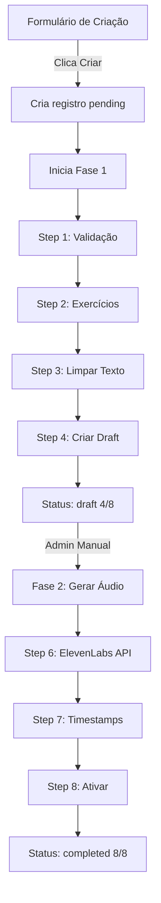

# Arquitetura do Pipeline de Criação de Lições

## Visão Geral

O pipeline de criação de lições é dividido em **2 FASES DISTINTAS**:

### 📋 FASE 1: Criação do Draft (Steps 1-4)
**Execução:** Automática  
**Status Final:** `draft`  
**Progresso:** 4/8 steps

| Step | Descrição | Função |
|------|-----------|---------|
| 1 | Intake & Validação | `step1-intake.ts` - Valida modelo, título, conteúdo |
| 2 | Geração de Exercícios | `step2-exercises.ts` - Cria exercícios estruturados |
| 3 | Limpeza de Texto | `step3-clean-text.ts` - Prepara texto para TTS |
| 4 | Criar Draft | `step4-create-draft.ts` - Insere na tabela `lessons` |

**Resultado:** Lição criada com `is_active: false`, sem áudio, aguardando Fase 2.

---

### 🎙️ FASE 2: Geração de Áudio e Ativação (Steps 6-8)
**Execução:** Manual (via Admin UI)  
**Status Final:** `completed`  
**Progresso:** 8/8 steps

| Step | Descrição | Função |
|------|-----------|---------|
| 5 | Interface Admin | **NÃO É UM STEP DE CÓDIGO** - Admin escolhe gerar áudio |
| 6 | Gerar Áudio | `step6-generate-audio.ts` - Chama ElevenLabs API |
| 7 | Calcular Timestamps | `step7-calculate-timestamps.ts` - Sincroniza texto com áudio |
| 8 | Ativar Lição | `step8-activate.ts` - Define `is_active: true` |

**Resultado:** Lição completa, ativa, com áudio e timestamps.

---

## ⚠️ IMPORTANTE: Por que 4/8 é CORRETO para status "draft"

Quando você vê:
```
Status: draft
Progresso: 4/8 steps
```

**Isso está CORRETO!** Significa que:
- ✅ Fase 1 foi completada com sucesso
- ⏸️ Aguardando intervenção manual para Fase 2
- 🚫 **NÃO é um erro!** É o comportamento esperado.

---

## 🐛 Problema: Múltiplas Execuções Duplicadas

### Causa
Cada clique no botão "Criar Pipeline" cria uma **NOVA linha** na tabela `pipeline_executions`.

### Exemplos vistos:
- 1 execução `completed` (4/8) ← CORRETO
- 1 execução `pending` (1/8) ← Clique adicional durante execução
- Várias `failed` (0/8) ← Erros de RLS ou validação

### Solução Implementada
1. **Status `draft`** agora é distinto de `completed`
2. **Mensagem clara** no Monitor: "Fase 1 Completa (4/8)"
3. **Botão "Continuar - Fase 2"** para executar steps 6-8
4. **Prevenir múltiplos cliques** (TODO: desabilitar botão durante execução)

---

## 🔧 Próximos Passos (TODO)

### Fase 2 - Implementação Pendente
- [ ] Implementar `continuePipelineWithAudio()` na edge function
- [ ] Conectar botão "Continuar - Fase 2" ao backend
- [ ] Executar steps 6, 7, 8 automaticamente

### Prevenção de Duplicatas
- [ ] Desabilitar botão "Criar" durante execução
- [ ] Verificar se já existe execução `draft` para o mesmo título
- [ ] Permitir "retomar" execuções existentes em vez de criar novas

### UX Improvements
- [ ] Progresso visual mais claro (Fase 1: 4/4, Fase 2: 0/4)
- [ ] Timeline mostrando: Draft → Gerar Áudio → Ativar
- [ ] Estimativa de tempo para Fase 2

---

## 📊 Fluxo Completo



---

## 🚨 Troubleshooting

### Erro: "row-level security policy"
**Causa:** JWT token expirado ou usuário não é admin  
**Solução:** Fazer logout/login ou verificar role na tabela `user_roles`

### Múltiplas execuções com mesmo título
**Causa:** Múltiplos cliques no botão "Criar"  
**Solução:** Aguardar conclusão da Fase 1 antes de criar nova lição

### Status "completed" mas só 4/8 steps
**Causa:** Bug corrigido - agora usa status "draft"  
**Solução:** Atualizar código para versão mais recente

---

## 📝 Convenções de Status

| Status | Significado | Progresso |
|--------|-------------|-----------|
| `pending` | Criado, aguardando início | 0/8 |
| `running` | Executando Fase 1 ou 2 | 1-7/8 |
| `draft` | **Fase 1 completa** | 4/8 |
| `completed` | **Fases 1 e 2 completas** | 8/8 |
| `failed` | Erro em qualquer step | 0-7/8 |
| `paused` | Pausado manualmente (futuro) | Variável |

---

**Última atualização:** 2025-11-12  
**Versão:** 1.0
