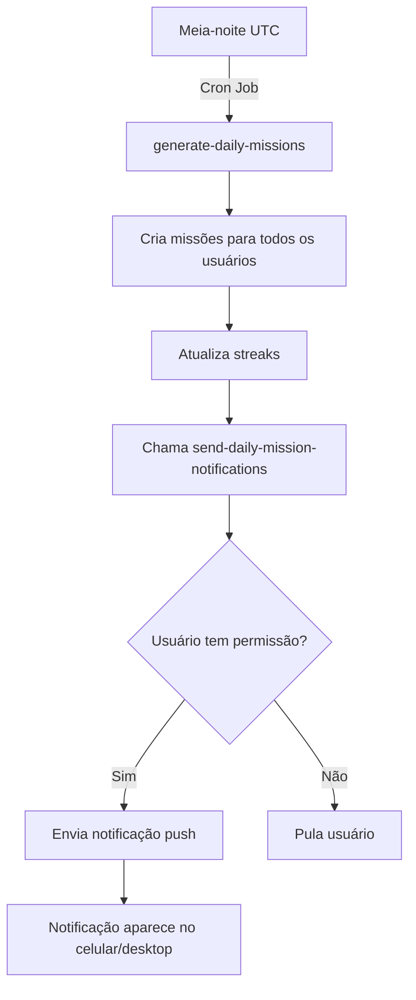

# 🔔 Sistema de Notificações Push PWA

## Visão Geral

O sistema de notificações push foi implementado para avisar usuários quando novas missões diárias estão disponíveis. Utiliza a API de Notificações Web (PWA) que funciona diretamente no navegador, sem necessidade de app nativo.

## Como Funciona

### 1. **Configuração PWA** ✅
- Plugin `vite-plugin-pwa` instalado e configurado
- Manifest com ícones e metadata
- Service Worker para suporte offline
- Meta tags mobile-optimized no `index.html`

### 2. **Solicitação de Permissão** 🔔
- Componente `<NotificationPrompt>` aparece após 5 segundos no Dashboard
- Usuário pode permitir ou recusar notificações
- Permissão é armazenada pelo navegador
- Notificação de teste é enviada ao ativar

### 3. **Geração Automática de Missões** ⏰
- Cron job roda todo dia à **meia-noite UTC** (21h horário de Brasília)
- Edge function `generate-daily-missions` cria missões para todos os usuários
- Após criar as missões, chama automaticamente `send-daily-mission-notifications`

### 4. **Envio de Notificações** 📨
- Edge function `send-daily-mission-notifications` é executada
- Identifica usuários com permissão concedida
- Envia notificação push via Web Push API
- Aparece como notificação nativa do sistema operacional

## Arquivos Criados

```
src/hooks/useNotifications.ts           # Hook para gerenciar permissões
src/components/NotificationPrompt.tsx   # UI para solicitar permissão
supabase/functions/send-daily-mission-notifications/
  └── index.ts                          # Edge function para envio
vite.config.ts                          # Configuração PWA
```

## Arquivos Modificados

```
index.html                              # Meta tags PWA
supabase/config.toml                    # Config da nova edge function
supabase/functions/generate-daily-missions/
  └── index.ts                          # Chama função de notificação
src/pages/Dashboard.tsx                 # Integra NotificationPrompt
```

## Compatibilidade

### ✅ Funciona em:
- **Chrome/Edge** (Desktop e Mobile) - 100%
- **Firefox** (Desktop e Mobile) - 100%
- **Safari** (Desktop) - 100%
- **Safari iOS 16.4+** - Apenas se app for instalado na tela inicial

### ⚠️ Limitações:
- iOS requer instalação do PWA (Add to Home Screen)
- Notificações não funcionam se o site estiver em janela anônima

## Como Testar

### 1. Teste Manual Imediato
```typescript
// No console do navegador no Dashboard:
new Notification('Teste', {
  body: 'Suas missões diárias estão disponíveis!',
  icon: '/logo-ailiv.png'
});
```

### 2. Teste do Cron Job
```sql
-- Execute no Supabase SQL Editor para testar imediatamente:
SELECT net.http_post(
  url:='https://pspvppymcdjbwsudxzdx.supabase.co/functions/v1/generate-daily-missions',
  headers:='{"Authorization": "Bearer YOUR_ANON_KEY"}'::jsonb,
  body:='{}'::jsonb
);
```

### 3. Verificar Logs
- Vá para Cloud → Edge Functions → generate-daily-missions
- Verifique se há linha: "✅ Notificações enviadas com sucesso"

## Fluxo Completo



## Próximos Passos (Futuro)

Para implementação completa de Web Push, seria necessário:

1. **Gerar VAPID Keys**
   ```bash
   npx web-push generate-vapid-keys
   ```

2. **Armazenar Push Subscriptions**
   - Criar tabela `push_subscriptions` no Supabase
   - Salvar endpoint, keys e auth do subscription

3. **Implementar Web Push Protocol**
   - Usar biblioteca `web-push` no edge function
   - Enviar notificações usando VAPID authentication

## Referências

- [MDN - Web Notifications API](https://developer.mozilla.org/en-US/docs/Web/API/Notifications_API)
- [PWA Best Practices](https://web.dev/notifications/)
- [Vite PWA Plugin](https://vite-pwa-org.netlify.app/)
