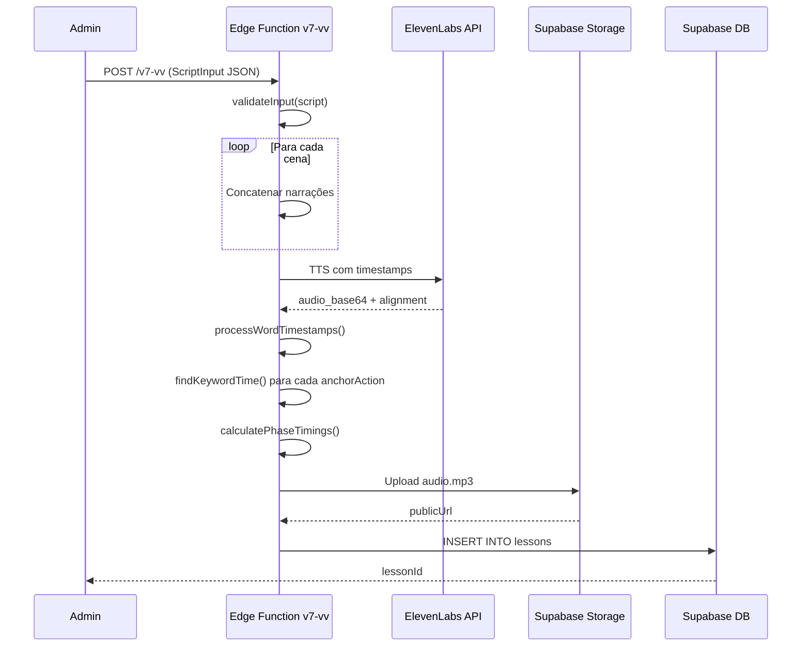
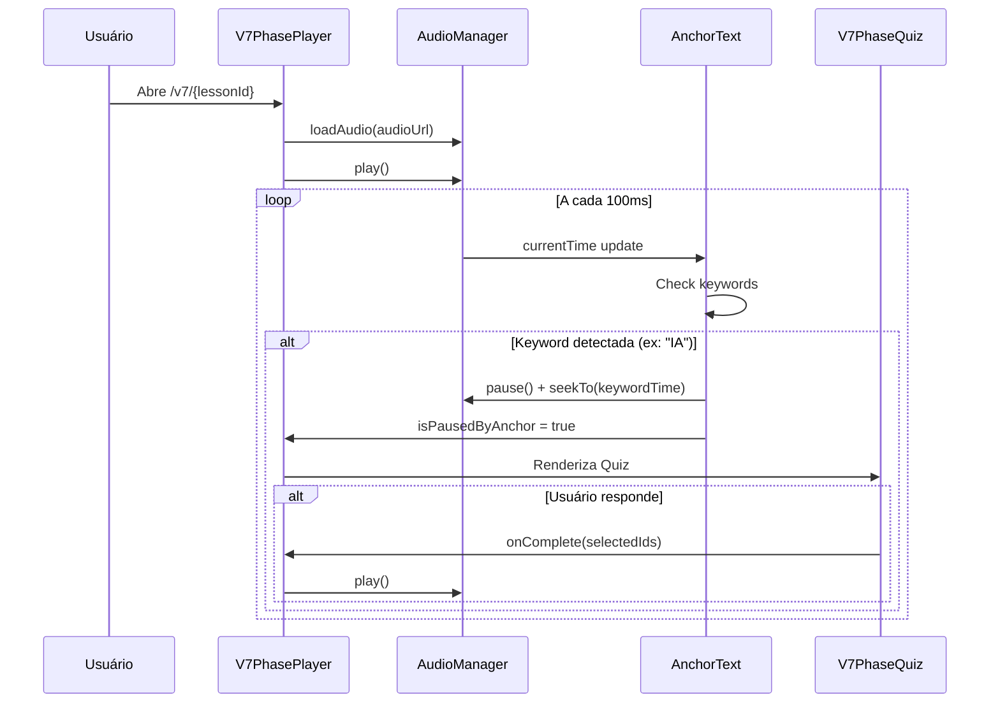

# V7-VV Documentação Técnica Completa

## 📋 Índice

1. [Visão Geral](#visão-geral)
2. [Arquitetura do Sistema](#arquitetura-do-sistema)
3. [Fluxo de Dados](#fluxo-de-dados)
4. [Estrutura do JSON de Entrada](#estrutura-do-json-de-entrada)
5. [Pipeline de Processamento](#pipeline-de-processamento)
6. [Sistema de Sincronização (AnchorText)](#sistema-de-sincronização-anchortext)
7. [Componentes do Player](#componentes-do-player)
8. [Tipos de Fases](#tipos-de-fases)
9. [Sistema de Áudio](#sistema-de-áudio)
10. [Sistema de Legendas](#sistema-de-legendas)
11. [Fluxo Pós-Aula](#fluxo-pós-aula)
12. [Banco de Dados](#banco-de-dados)
13. [Modelo JSON Definitivo](#modelo-json-definitivo)
14. [Checklist para Nova Aula](#checklist-para-nova-aula)

---

## 1. Visão Geral

O sistema V7-vv é uma plataforma de criação de aulas cinematográficas que combina:

- **Narração com áudio sincronizado** (ElevenLabs TTS)
- **Legendas em tempo real** com timestamps por palavra
- **Fases visuais dinâmicas** (dramático, narrativo, quiz, playground, revelação)
- **Interações bloqueantes** (quiz pausa até resposta)
- **Sistema de gamificação** (XP, moedas, patentes)

### Características Principais

| Recurso | Descrição |
|---------|-----------|
| **AnchorText** | Sincronização por palavra-chave (não por tempo) |
| **WordTimestamps** | Cada palavra tem início e fim precisos |
| **Fases Bloqueantes** | Quiz/Playground pausam até interação |
| **Feedback Narrado** | Cada opção de quiz tem áudio próprio |
| **Modal de Saída** | Confirmação antes de sair da aula |

---

## 2. Arquitetura do Sistema

```
┌─────────────────────────────────────────────────────────────────────┐
│                        ADMIN INTERFACE                               │
│   (AdminV7Create.tsx - Formulário JSON de entrada)                  │
└─────────────────────────────────────────────────────────────────────┘
                                   │
                                   ▼
┌─────────────────────────────────────────────────────────────────────┐
│                     EDGE FUNCTION: v7-vv/index.ts                   │
│  ┌─────────────┐   ┌─────────────┐   ┌─────────────────────────┐   │
│  │ Validação   │ → │ Geração de  │ → │ Cálculo de Timings      │   │
│  │ do Script   │   │ Áudio       │   │ (WordTimestamps)        │   │
│  └─────────────┘   └─────────────┘   └─────────────────────────┘   │
│                                              │                       │
│                                              ▼                       │
│                     ┌───────────────────────────────────────────┐   │
│                     │ Geração de V7LessonData (JSON final)      │   │
│                     │ - Phases com startTime/endTime            │   │
│                     │ - AnchorActions com keywordTime           │   │
│                     │ - FeedbackAudios para quiz                │   │
│                     └───────────────────────────────────────────┘   │
└─────────────────────────────────────────────────────────────────────┘
                                   │
                                   ▼
┌─────────────────────────────────────────────────────────────────────┐
│                       SUPABASE DATABASE                              │
│  ┌─────────────────────────────────────────────────────────────┐   │
│  │ lessons table                                                │   │
│  │ - content: JSONB (V7LessonData)                             │   │
│  │ - audio_url: TEXT                                            │   │
│  │ - word_timestamps: JSONB                                     │   │
│  └─────────────────────────────────────────────────────────────┘   │
└─────────────────────────────────────────────────────────────────────┘
                                   │
                                   ▼
┌─────────────────────────────────────────────────────────────────────┐
│                         FRONTEND PLAYER                             │
│  ┌─────────────────┐  ┌─────────────────┐  ┌───────────────────┐   │
│  │ useV7PhaseScript│  │ V7PhasePlayer   │  │ V7PostLessonFlow  │   │
│  │ (Data Fetching) │→ │ (Orchestrator)  │→ │ (Exercício+Reward)│   │
│  └─────────────────┘  └─────────────────┘  └───────────────────┘   │
│           │                    │                     │              │
│           ▼                    ▼                     ▼              │
│  ┌─────────────────┐  ┌─────────────────┐  ┌───────────────────┐   │
│  │ useV7AudioMgr   │  │ useAnchorText   │  │ V7SyncCaptions    │   │
│  │ (Play/Pause)    │  │ (Keyword Sync)  │  │ (Legendas)        │   │
│  └─────────────────┘  └─────────────────┘  └───────────────────┘   │
└─────────────────────────────────────────────────────────────────────┘
```

---

## 3. Fluxo de Dados

### 3.1 Criação da Aula



### 3.2 Reprodução da Aula



---

## 4. Estrutura do JSON de Entrada (ScriptInput)

Este é o formato que o administrador deve fornecer:

```typescript
interface ScriptInput {
  // Metadados da aula
  title: string;                    // "A Revolução da IA"
  subtitle?: string;                // "Como usar prompts profissionais"
  difficulty: 'beginner' | 'intermediate' | 'advanced';
  category: string;                 // "fundamentos-ia"
  tags: string[];                   // ["prompts", "produtividade"]
  learningObjectives: string[];     // ["Entender...", "Aplicar..."]
  
  // Configurações de áudio
  voice_id?: string;                // ID da voz ElevenLabs
  generate_audio?: boolean;         // default: true
  fail_on_audio_error?: boolean;    // default: false
  
  // Cenas (OBRIGATÓRIO)
  scenes: ScriptScene[];
}

interface ScriptScene {
  id: string;                       // "scene-1-dramatic"
  title: string;                    // "Estatística Chocante"
  type: SceneType;                  // Ver tipos abaixo
  
  // NARRAÇÃO (texto falado pela IA)
  narration: string;                // "Noventa e oito por cento..."
  
  // ANCHOR TEXT (sincronização)
  anchorText?: {
    pauseAt?: string;               // "IA" - pausa quando falar esta palavra
    transitionAt?: string;          // Palavra que transiciona para próxima fase
  };
  
  // VISUAL (o que aparece na tela)
  visual: {
    type: VisualType;
    content: Record<string, unknown>;
    effects?: {
      mood?: 'danger' | 'success' | 'warning' | 'neutral';
      particles?: boolean;
      glow?: boolean;
    };
    microVisuals?: MicroVisual[];   // Elementos que aparecem durante narração
  };
  
  // INTERAÇÃO (para quiz, playground, cta)
  interaction?: {
    type: 'quiz' | 'playground' | 'cta-button';
    options?: QuizOption[];
    // ... outros campos específicos
  };
}
```

### 4.1 Tipos de Cenas (SceneType)

| Tipo | Descrição | Requer `anchorText.pauseAt`? |
|------|-----------|------------------------------|
| `dramatic` | Número impactante (98%, 30M) | ❌ Não |
| `narrative` | Texto + items | ❌ Não |
| `comparison` | Split-screen (lado a lado) | ❌ Não |
| `interaction` | Quiz de múltipla escolha | ✅ **SIM** |
| `playground` | Comparação prompt amador vs pro | ✅ **SIM** |
| `revelation` | Revelação (PERFEITO) | ❌ Não (autoplay) |
| `secret-reveal` | Revelação com áudio próprio | ✅ **SIM** |
| `cta` | Call-to-action com botão | ✅ **SIM** |
| `gamification` | Resultado final | ❌ Não |

---

## 5. Pipeline de Processamento (v7-vv/index.ts)

### 5.1 Etapas do Pipeline

```typescript
// 1. VALIDAÇÃO
const errors = validateInput(input);
if (errors.length > 0) throw new Error(errors.join(', '));

// 2. CONCATENAR NARRAÇÕES
const fullNarration = scenes
  .map(s => s.narration)
  .join(' ');

// 3. GERAR ÁUDIO
const audioResult = await generateAudio(fullNarration, voiceId, supabase, 'v7-main');
// Retorna: { url, wordTimestamps, duration }

// 4. CALCULAR TIMINGS DAS FASES
let currentWordIndex = 0;
const phases = scenes.map((scene, i) => {
  const range = findNarrationRange(scene.narration, wordTimestamps, currentWordIndex);
  currentWordIndex = range.endIdx + 1;
  
  return {
    id: scene.id,
    type: scene.type,
    startTime: range.startTime,
    endTime: range.endTime,
    // ...
  };
});

// 5. CALCULAR ANCHOR ACTIONS
phases.forEach(phase => {
  if (phase.anchorText?.pauseAt) {
    const keywordTime = findKeywordTime(phase.anchorText.pauseAt, wordTimestamps, phase.startTime);
    phase.anchorActions = [{
      id: `pause-${phase.id}`,
      keyword: phase.anchorText.pauseAt,
      keywordTime: keywordTime,
      type: 'pause',
      once: true,
    }];
  }
});

// 6. GERAR FEEDBACK AUDIOS (para quiz)
for (const phase of phases) {
  if (phase.interaction?.type === 'quiz') {
    for (const option of phase.interaction.options) {
      if (option.feedback?.narration) {
        const feedback = await generateAudio(option.feedback.narration, voiceId, supabase, `feedback-${option.id}`);
        feedbackAudios[option.id] = {
          id: option.id,
          url: feedback.url,
          duration: feedback.duration,
          wordTimestamps: feedback.wordTimestamps,
        };
      }
    }
  }
}

// 7. MONTAR V7LessonData
const lessonData: V7LessonData = {
  model: 'v7-cinematic',
  version: 'vv',
  metadata: { title, subtitle, difficulty, ... },
  phases,
  audio: {
    mainAudio: { id: 'main', url, duration, wordTimestamps },
    feedbackAudios,
  },
};

// 8. SALVAR NO BANCO
await supabase.from('lessons').insert({
  title,
  content: lessonData,
  audio_url: audioResult.url,
  word_timestamps: audioResult.wordTimestamps,
  lesson_type: 'v7',
  // ...
});
```

### 5.2 Funções Críticas

#### `findKeywordTime(keyword, wordTimestamps, afterTime)`

```typescript
function findKeywordTime(keyword: string, wordTimestamps: WordTimestamp[], afterTime: number): number | null {
  const keywordParts = keyword.split(/\s+/).map(normalizeWord);
  
  // Multi-word: busca sequência com tolerância de gap
  if (keywordParts.length > 1) {
    for (let i = 0; i < wordTimestamps.length; i++) {
      if (wordTimestamps[i].start < afterTime) continue;
      
      // Verifica se as próximas palavras formam a frase
      let matchPositions = [i];
      // ... lógica de matching
      
      if (matchPositions.length === keywordParts.length) {
        return wordTimestamps[matchPositions[matchPositions.length - 1]].end;
      }
    }
  }
  
  // Single word: busca exata
  for (const ts of wordTimestamps) {
    if (ts.start < afterTime) continue;
    if (normalizeWord(ts.word) === keywordParts[0]) {
      return ts.end;
    }
  }
  
  return null;
}
```

#### `processWordTimestamps(characters, characterStartTimes)`

```typescript
function processWordTimestamps(characters: string[], characterStartTimes: number[]): WordTimestamp[] {
  const words: WordTimestamp[] = [];
  let currentWord = '';
  let wordStartIndex = 0;

  for (let i = 0; i < characters.length; i++) {
    const char = characters[i];

    if (char === ' ' || char === '\n' || i === characters.length - 1) {
      if (currentWord.trim().length > 0) {
        words.push({
          word: currentWord.trim(),
          start: characterStartTimes[wordStartIndex],
          end: characterStartTimes[i],
        });
      }
      currentWord = '';
      wordStartIndex = i + 1;
    } else {
      currentWord += char;
    }
  }

  return words;
}
```

---

## 6. Sistema de Sincronização (AnchorText)

### 6.1 Como Funciona

O sistema AnchorText detecta palavras-chave no áudio em tempo real:

```typescript
// useAnchorText.ts
export function useAnchorText({
  wordTimestamps,
  currentTime,
  actions,
  isPlaying,
  phaseId,
  enabled,
  onPause,
  onResume,
}) {
  // A cada update de currentTime, verifica se alguma keyword foi alcançada
  useEffect(() => {
    for (const action of actions) {
      // Se action tem keywordTime (pré-calculado pelo Pipeline)
      if (action.keywordTime !== undefined) {
        const triggerPoint = action.keywordTime - 0.1; // 100ms antes para precisão
        const isNear = currentTime >= triggerPoint && currentTime <= action.keywordTime + 0.4;
        
        if (isNear) {
          executeAction(action, { end: action.keywordTime });
        }
      }
    }
  }, [currentTime, actions]);
}
```

### 6.2 Tipos de Ações

| Tipo | Descrição |
|------|-----------|
| `pause` | Pausa o áudio e aguarda interação |
| `resume` | Retoma o áudio |
| `show` | Mostra um elemento visual |
| `hide` | Esconde um elemento |
| `highlight` | Destaca texto |
| `trigger` | Callback customizado |

### 6.3 Exemplo de AnchorAction

```json
{
  "id": "pause-quiz-1",
  "keyword": "IA",
  "keywordTime": 33.425,
  "type": "pause",
  "once": true
}
```

Quando o áudio chega em `33.425s` (palavra "IA"), o sistema:
1. Pausa o áudio **imediatamente**
2. Faz seek-back para `33.425s` (evita vazamento de áudio)
3. Marca `isPausedByAnchor = true`
4. Player renderiza o Quiz
5. Aguarda usuário responder

---

## 7. Componentes do Player

### 7.1 Hierarquia de Componentes

```
V7CinematicPlayer.tsx (Página)
├── useV7PhaseScript (Hook - busca dados)
├── V7PhasePlayer.tsx (Orquestrador principal)
│   ├── useV7AudioManager (Controle de áudio)
│   ├── useAnchorText (Sincronização)
│   ├── usePhaseController (Navegação entre fases)
│   ├── V7CinematicCanvas (Background visual)
│   ├── V7SynchronizedCaptions (Legendas)
│   ├── V7MinimalControls (Play/Pause/Volume)
│   ├── V7AudioIndicator (Indicador de áudio)
│   └── [Componentes de Fase]
│       ├── V7PhaseDramatic
│       ├── V7PhaseNarrative
│       ├── V7PhaseQuiz
│       ├── V7PhasePlayground
│       ├── V7PhaseSecretReveal
│       └── ...
└── V7PostLessonFlow.tsx (Pós-aula)
    ├── V7LessonCompleteCard
    ├── V7PerfeitoDragDrop (Exercício)
    ├── V7ExerciseResultCard
    └── V7RewardsModal
```

### 7.2 V7PhasePlayer - Estados Principais

```typescript
const [isLoading, setIsLoading] = useState(true);
const [showControls, setShowControls] = useState(true);
const [showExitConfirm, setShowExitConfirm] = useState(false);

// Do useAnchorText
const { isPausedByAnchor, manualResume } = useAnchorText({ ... });

// Do usePhaseController
const { currentPhase, currentPhaseIndex, phaseProgress, goToPhase } = usePhaseController({ ... });

// Do useV7AudioManager
const { isPlaying, currentTime, duration, play, pause, seekTo } = audio;
```

### 7.3 Lógica de Bloqueio de Fase

```typescript
// Fases que BLOQUEIAM avanço automático
const isBlockingPhase = 
  currentPhase?.type === 'interaction' || 
  currentPhase?.type === 'secret-reveal' ||
  currentPhase?.type === 'playground';

// Quando em fase blocking, NÃO chama onComplete mesmo se áudio terminar
useEffect(() => {
  if (isBlockingPhase) {
    isInBlockingPhaseRef.current = true;
  }
}, [isBlockingPhase]);

// onEnded do AudioManager verifica:
const audio = useV7AudioManager({
  onEnded: () => {
    if (isInBlockingPhaseRef.current) {
      console.log('Audio ended but in BLOCKING PHASE - NOT calling onComplete');
      return;
    }
    onComplete?.();
  }
});
```

---

## 8. Tipos de Fases

### 8.1 DRAMATIC

**Visual:** Número grande com animação count-up

```json
{
  "type": "dramatic",
  "visual": {
    "type": "number-reveal",
    "content": {
      "hookQuestion": "VOCÊ SABIA?",
      "number": "98%",
      "secondaryNumber": "2%",
      "subtitle": "das pessoas tratam IA como brinquedo",
      "mood": "danger"
    }
  }
}
```

### 8.2 COMPARISON

**Visual:** Split-screen lado a lado

```json
{
  "type": "comparison",
  "visual": {
    "type": "split-screen",
    "content": {
      "left": {
        "label": "OS 98%",
        "mood": "danger",
        "items": ["Pedem piadas", "Escrevem como pirata"]
      },
      "right": {
        "label": "OS 2%",
        "mood": "success", 
        "items": ["Faturam R$30mil/mês", "Usam como ferramenta"]
      }
    }
  }
}
```

### 8.3 INTERACTION (Quiz)

**OBRIGATÓRIO:** `anchorText.pauseAt`

```json
{
  "type": "interaction",
  "anchorText": {
    "pauseAt": "IA"
  },
  "visual": {
    "type": "quiz",
    "content": {
      "question": "Seja honesto: você faz parte de qual grupo?"
    }
  },
  "interaction": {
    "type": "quiz",
    "options": [
      {
        "id": "opt-1",
        "text": "Peço piadas e textos criativos",
        "category": "bad",
        "feedback": {
          "title": "Você Faz Parte dos 98%",
          "subtitle": "Mas calma, vou te mostrar o caminho dos 2%",
          "mood": "warning",
          "narration": "Tudo bem, a maioria está nesse grupo. Mas agora você vai aprender a diferença."
        }
      },
      {
        "id": "opt-2",
        "text": "Uso para trabalho mas sem estratégia",
        "category": "bad",
        "feedback": {
          "title": "Você está no caminho certo",
          "subtitle": "Falta apenas o método",
          "mood": "neutral",
          "narration": "Você já usa para trabalho, isso é bom. Agora vou te dar o método."
        }
      },
      {
        "id": "opt-3",
        "text": "Uso prompts estruturados profissionalmente",
        "category": "good",
        "feedback": {
          "title": "Parabéns!",
          "subtitle": "Você já está no caminho dos 2%",
          "mood": "success",
          "narration": "Excelente! Você já entende o poder dos prompts estruturados."
        }
      }
    ]
  }
}
```

### 8.4 REVELATION (PERFEITO)

**Visual:** Revelação letra por letra

```json
{
  "type": "revelation",
  "visual": {
    "type": "letter-reveal",
    "content": {
      "word": "PERFEITO",
      "letters": [
        { "letter": "P", "meaning": "Persona" },
        { "letter": "E", "meaning": "Expectativa" },
        { "letter": "R", "meaning": "Restrições" },
        { "letter": "F", "meaning": "Formato" },
        { "letter": "E", "meaning": "Exemplos" },
        { "letter": "I", "meaning": "Iteração" },
        { "letter": "T", "meaning": "Tom" },
        { "letter": "O", "meaning": "Output" }
      ],
      "finalStamp": "MÉTODO"
    }
  }
}
```

### 8.5 PLAYGROUND

**OBRIGATÓRIO:** `anchorText.pauseAt`

```json
{
  "type": "playground",
  "anchorText": {
    "pauseAt": "Veja a diferença"
  },
  "visual": {
    "type": "playground",
    "content": {
      "title": "Compare os Prompts",
      "instruction": "Veja como o método PERFEITO transforma resultados"
    }
  },
  "interaction": {
    "type": "playground",
    "amateurPrompt": "Escreva um email de vendas",
    "professionalPrompt": "Aja como especialista em copywriting B2B...",
    "amateurResult": {
      "title": "Resultado Genérico",
      "content": "Prezado cliente, gostaria de apresentar...",
      "score": 3,
      "verdict": "bad"
    },
    "professionalResult": {
      "title": "Resultado Profissional",
      "content": "João, percebi que sua empresa...",
      "score": 9,
      "verdict": "excellent"
    }
  }
}
```

---

## 9. Sistema de Áudio

### 9.1 useV7AudioManager

```typescript
export const useV7AudioManager = ({ onTimeUpdate, onEnded, onStateChange }) => {
  // Estado
  const [isPlaying, setIsPlaying] = useState(false);
  const [currentTime, setCurrentTime] = useState(0);
  const [duration, setDuration] = useState(0);
  const [volume, setVolumeState] = useState(0.8);
  
  // Refs
  const mainAudioRef = useRef<HTMLAudioElement | null>(null);
  
  // Métodos principais
  const loadAudio = useCallback((url: string) => {
    mainAudioRef.current.src = url;
    mainAudioRef.current.load();
  }, []);
  
  const play = useCallback(async () => {
    await mainAudioRef.current.play();
  }, []);
  
  const pause = useCallback(() => {
    mainAudioRef.current.pause();
  }, []);
  
  const seekTo = useCallback((time: number) => {
    mainAudioRef.current.currentTime = time;
  }, []);
  
  // Fade in/out para transições suaves
  const fadeToVolume = useCallback((targetVolume, duration) => { ... });
  const pauseWithFade = useCallback(async (fadeDuration) => { ... });
  const resumeWithFade = useCallback(async (fadeDuration) => { ... });
  
  return { isPlaying, currentTime, duration, play, pause, seekTo, ... };
};
```

### 9.2 Feedback Audios

Para cada opção de quiz com narração de feedback:

```typescript
// No V7PhasePlayer, quando quiz é respondido:
const handleQuizComplete = async (selectedIds: string[]) => {
  const selectedOption = quizOptions.find(o => selectedIds.includes(o.id));
  
  if (selectedOption && feedbackAudios?.[selectedOption.id]) {
    // Tocar áudio de feedback específico
    const feedbackAudio = new Audio(feedbackAudios[selectedOption.id].url);
    await feedbackAudio.play();
    
    // Aguardar término do feedback
    await new Promise(resolve => feedbackAudio.onended = resolve);
  }
  
  // Retomar áudio principal
  audio.play();
};
```

---

## 10. Sistema de Legendas

### 10.1 V7SynchronizedCaptions

Exibe 1-2 frases por vez (não palavra por palavra):

```typescript
const V7SynchronizedCaptions = ({ wordTimestamps, currentTime }) => {
  // Agrupa palavras em frases
  const sentences = useMemo(() => {
    const result = [];
    let currentSentence = [];
    
    wordTimestamps.forEach((word, index) => {
      currentSentence.push(word);
      
      // Nova frase quando:
      // 1. Pontuação final (. ! ?)
      // 2. 15+ palavras
      // 3. Pausa longa (>1.5s)
      const isEnd = isSentenceEnd(word.word);
      const isTooLong = currentSentence.length >= 15;
      const hasLongPause = nextWord && (nextWord.start - word.end) > 1.5;
      
      if (isEnd || isTooLong || hasLongPause) {
        result.push({
          text: currentSentence.map(w => w.word).join(' '),
          startTime: currentSentence[0].start,
          endTime: word.end,
        });
        currentSentence = [];
      }
    });
    
    return result;
  }, [wordTimestamps]);
  
  // Encontra frase atual
  const currentSentence = sentences.find(
    s => currentTime >= s.startTime && currentTime < s.endTime + 0.5
  );
  
  // Renderiza com highlight semântico
  return (
    <motion.div className="fixed bottom-[100px] ...">
      <p>{renderHighlightedText(currentSentence.text)}</p>
    </motion.div>
  );
};
```

### 10.2 Highlight Semântico

```typescript
const renderHighlightedText = (text: string) => {
  const patterns = [
    // Verde: Valores monetários
    { regex: /(R\$\s*[\d.,]+|[\d.,]+\s*mil\s*reais)/gi, color: 'text-green-400' },
    // Vermelho: Porcentagens
    { regex: /(\d+%)/g, color: 'text-red-400' },
    // Amarelo: Palavras-chave
    { regex: /\b(PERFEITO|MÉTODO|PROMPTS?|IA)\b/gi, color: 'text-yellow-400' },
  ];
  
  // Aplica cores aos matches
  // ...
};
```

---

## 11. Fluxo Pós-Aula

### 11.1 V7PostLessonFlow

```typescript
type FlowStage = 
  | 'lesson_complete'   // Card de conclusão
  | 'exercise'          // Drag-and-drop PERFEITO
  | 'results'           // Resultado do exercício
  | 'rewards';          // Modal de recompensas

const V7PostLessonFlow = ({ lessonTitle, lessonId, onComplete }) => {
  const [stage, setStage] = useState<FlowStage>('lesson_complete');
  
  // Quando chega em 'results', registra gamificação
  useEffect(() => {
    if (stage === 'results') {
      registerGamificationEvent('lesson_completed', lessonId, {
        exerciseScore,
        completedAt: new Date().toISOString(),
      });
    }
  }, [stage]);
  
  return (
    <AnimatePresence mode="wait">
      {stage === 'lesson_complete' && <V7LessonCompleteCard onContinue={() => setStage('exercise')} />}
      {stage === 'exercise' && <V7PerfeitoDragDrop onComplete={(score) => setStage('results')} />}
      {stage === 'results' && <V7ExerciseResultCard onViewRewards={() => setStage('rewards')} />}
      {stage === 'rewards' && <V7RewardsModal onContinue={goToTrail} />}
    </AnimatePresence>
  );
};
```

### 11.2 V7PerfeitoDragDrop

Exercício onde usuário arrasta letras do PERFEITO para seus significados.

### 11.3 V7ExitConfirmModal

Modal de confirmação antes de sair:

```typescript
const V7ExitConfirmModal = ({ isOpen, onConfirmExit, onContinue }) => (
  <AnimatePresence>
    {isOpen && (
      <motion.div className="fixed inset-0 z-50 bg-black/80">
        <div className="bg-slate-800 rounded-2xl p-8">
          <h2>Deseja sair da aula?</h2>
          <p>Seu progresso será salvo.</p>
          <Button onClick={onContinue}>Continuar Aula</Button>
          <Button onClick={onConfirmExit}>Sair</Button>
        </div>
      </motion.div>
    )}
  </AnimatePresence>
);
```

---

## 12. Banco de Dados

### 12.1 Tabela `lessons`

```sql
CREATE TABLE lessons (
  id UUID PRIMARY KEY DEFAULT gen_random_uuid(),
  title TEXT NOT NULL,
  description TEXT,
  content JSONB NOT NULL,           -- V7LessonData completo
  audio_url TEXT,                   -- URL do áudio principal
  audio_urls TEXT[],                -- Array para múltiplos áudios
  word_timestamps JSONB,            -- WordTimestamp[]
  trail_id UUID REFERENCES trails(id),
  order_index INTEGER NOT NULL,
  lesson_type TEXT,                 -- 'v7', 'guided', etc
  model TEXT,                       -- 'v7-cinematic'
  difficulty_level difficulty_level,
  estimated_time INTEGER,
  is_active BOOLEAN DEFAULT true,
  status TEXT,
  created_at TIMESTAMPTZ DEFAULT now()
);
```

### 12.2 Estrutura do `content` (JSONB)

```typescript
interface V7LessonData {
  model: 'v7-cinematic';
  version: 'vv';
  metadata: {
    title: string;
    subtitle: string;
    difficulty: 'beginner' | 'intermediate' | 'advanced';
    category: string;
    tags: string[];
    learningObjectives: string[];
    totalDuration: number;
    phaseCount: number;
    createdAt: string;
    generatedBy: 'V7-vv';
  };
  phases: V7Phase[];
  audio: {
    mainAudio: {
      id: string;
      url: string;
      duration: number;
      wordTimestamps: WordTimestamp[];
    };
    feedbackAudios?: Record<string, {
      id: string;
      url: string;
      duration: number;
      wordTimestamps: WordTimestamp[];
    }>;
  };
}
```

---

## 13. Modelo JSON Definitivo

### 13.1 Template Completo para Nova Aula

```json
{
  "title": "Título da Aula",
  "subtitle": "Subtítulo explicativo",
  "difficulty": "beginner",
  "category": "nome-da-categoria",
  "tags": ["tag1", "tag2", "tag3"],
  "learningObjectives": [
    "Objetivo 1",
    "Objetivo 2"
  ],
  "voice_id": "XB0fDUnXU5powFXDhCwa",
  "generate_audio": true,
  "fail_on_audio_error": false,
  
  "scenes": [
    {
      "id": "scene-1-dramatic",
      "title": "Impacto Inicial",
      "type": "dramatic",
      "narration": "Texto que será narrado pela IA para esta cena.",
      "visual": {
        "type": "number-reveal",
        "content": {
          "hookQuestion": "VOCÊ SABIA?",
          "number": "98%",
          "subtitle": "das pessoas fazem isso errado",
          "mood": "danger"
        },
        "effects": {
          "particles": true,
          "glow": true
        }
      }
    },
    {
      "id": "scene-2-comparison",
      "title": "Comparação",
      "type": "comparison",
      "narration": "Veja a diferença entre os dois grupos.",
      "visual": {
        "type": "split-screen",
        "content": {
          "left": {
            "label": "ERRADO",
            "mood": "danger",
            "items": ["Item 1", "Item 2"]
          },
          "right": {
            "label": "CERTO",
            "mood": "success",
            "items": ["Item 1", "Item 2"]
          }
        }
      }
    },
    {
      "id": "scene-3-quiz",
      "title": "Auto-avaliação",
      "type": "interaction",
      "narration": "Seja honesto: você faz parte de qual grupo? Pense bem antes de responder.",
      "anchorText": {
        "pauseAt": "responder"
      },
      "visual": {
        "type": "quiz",
        "content": {
          "question": "Você faz parte de qual grupo?"
        }
      },
      "interaction": {
        "type": "quiz",
        "options": [
          {
            "id": "opt-bad-1",
            "text": "Faço errado",
            "category": "bad",
            "feedback": {
              "title": "Calma!",
              "subtitle": "Vou te mostrar o caminho",
              "mood": "warning",
              "narration": "Tudo bem, a maioria está assim. Mas agora você vai aprender."
            }
          },
          {
            "id": "opt-good-1",
            "text": "Faço certo",
            "category": "good",
            "feedback": {
              "title": "Parabéns!",
              "subtitle": "Você está no caminho certo",
              "mood": "success",
              "narration": "Excelente! Você já entende a importância."
            }
          }
        ]
      }
    },
    {
      "id": "scene-4-revelation",
      "title": "O Método",
      "type": "revelation",
      "narration": "Agora vou te revelar o método que separa amadores de profissionais.",
      "visual": {
        "type": "letter-reveal",
        "content": {
          "word": "MÉTODO",
          "letters": [
            { "letter": "M", "meaning": "Significado 1" },
            { "letter": "É", "meaning": "Significado 2" },
            { "letter": "T", "meaning": "Significado 3" },
            { "letter": "O", "meaning": "Significado 4" },
            { "letter": "D", "meaning": "Significado 5" },
            { "letter": "O", "meaning": "Significado 6" }
          ],
          "finalStamp": "APLIQUE"
        }
      }
    },
    {
      "id": "scene-5-gamification",
      "title": "Conclusão",
      "type": "gamification",
      "narration": "Parabéns! Você completou a primeira etapa da sua jornada.",
      "visual": {
        "type": "result",
        "content": {
          "emoji": "🎉",
          "title": "Aula Completa!",
          "message": "Você está pronto para o próximo passo.",
          "metrics": [
            { "label": "XP", "value": "+100" },
            { "label": "Moedas", "value": "+25" }
          ],
          "ctaText": "Continuar Jornada"
        }
      }
    }
  ]
}
```

---

## 14. Checklist para Nova Aula

### 14.1 Antes de Criar

- [ ] Definir título e subtítulo claros
- [ ] Listar 3-5 objetivos de aprendizado
- [ ] Escrever roteiro narrativo completo
- [ ] Identificar pontos de pausa (interações)
- [ ] Definir palavras-chave para cada anchorText

### 14.2 Estrutura do JSON

- [ ] Cada cena tem `id` único
- [ ] Cada cena tem `type` válido
- [ ] Cada cena tem `narration` (texto falado)
- [ ] Cenas interativas têm `anchorText.pauseAt`
- [ ] Quiz tem `options` com `feedback` e `narration`
- [ ] Palavras do `pauseAt` existem na narração

### 14.3 Após Gerar

- [ ] Verificar se áudio foi gerado
- [ ] Verificar se wordTimestamps foram calculados
- [ ] Testar reprodução completa
- [ ] Testar pausa nos pontos de interação
- [ ] Testar feedback de quiz
- [ ] Testar fluxo pós-aula

### 14.4 Debugging

**Quiz não pausa?**
- Verificar se `anchorText.pauseAt` existe
- Verificar se a palavra está na narração
- Ver console: `[AnchorText] ✅ Found keyword`

**Áudio não sincroniza?**
- Verificar `wordTimestamps` no banco
- Ver console: `[V7PhasePlayer] ⏸️ ANCHOR PAUSE`

**Feedback não toca?**
- Verificar `feedbackAudios` no content
- Ver console: `[V7PhasePlayer] Playing feedback audio`

---

## 15. Arquivos-Chave do Sistema

| Arquivo | Responsabilidade |
|---------|------------------|
| `supabase/functions/v7-vv/index.ts` | Pipeline de geração |
| `src/types/V7Contract.ts` | Tipos compartilhados |
| `src/hooks/useV7PhaseScript.ts` | Carrega dados da aula |
| `src/components/lessons/v7/cinematic/V7PhasePlayer.tsx` | Orquestrador principal |
| `src/components/lessons/v7/cinematic/useAnchorText.ts` | Sincronização por keyword |
| `src/components/lessons/v7/cinematic/useV7AudioManager.ts` | Controle de áudio |
| `src/components/lessons/v7/cinematic/V7PostLessonFlow.tsx` | Fluxo pós-aula |
| `src/components/lessons/v7/V7SynchronizedCaptions.tsx` | Legendas sincronizadas |

---

*Documentação criada em: Janeiro 2026*
*Versão: V7-vv Definitive*
