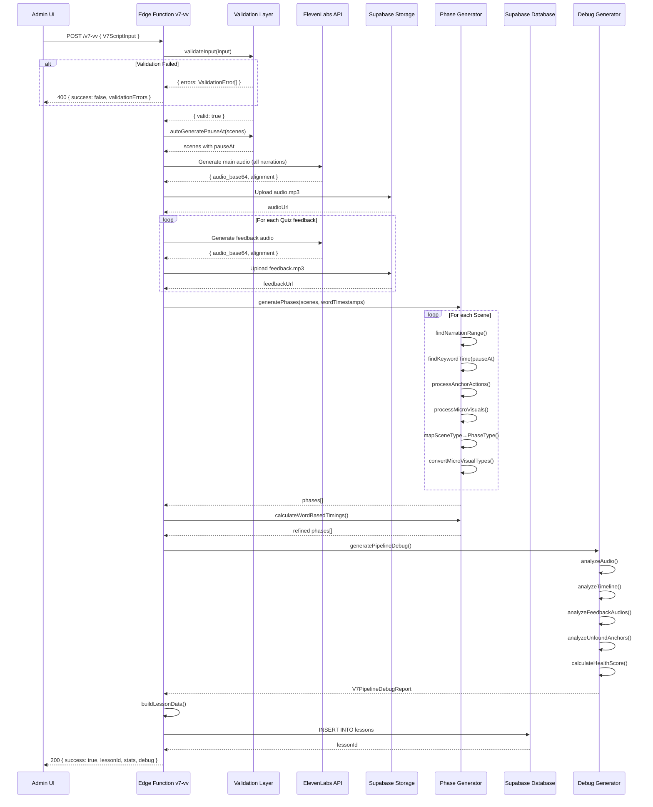
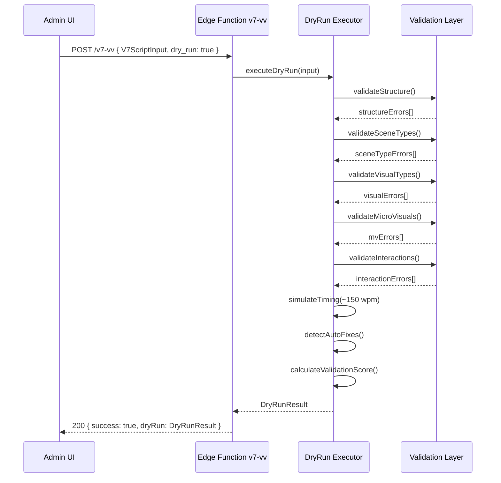
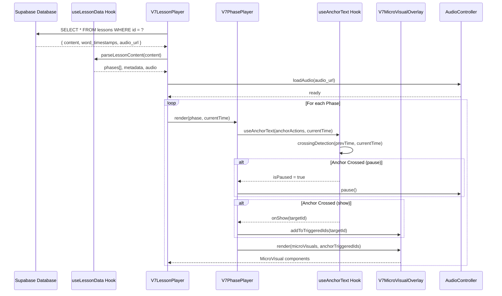

# V7-VV Pipeline - Documentação Técnica Completa

> **Versão:** V7-v2 (Contrato Congelado v1.0)  
> **Última Atualização:** 2026-02-03  
> **Autor:** AIliv Development Team

---

## 1. VISÃO GERAL

O **Pipeline V7-vv** é o sistema de geração automatizada de aulas cinematográficas do AIliv. Ele recebe um JSON estruturado (`V7ScriptInput`) e produz uma aula completa com:

- Áudio sincronizado via ElevenLabs (word-level timestamps)
- Fases visuais com micro-visuais sincronizados
- Anchor Actions para pausas e transições
- Interações (Quiz, Playground)
- Debug Report automático para diagnóstico

### 1.1 Arquitetura Geral

```
┌─────────────────────────────────────────────────────────────────────────────┐
│                           V7-VV PIPELINE ARCHITECTURE                        │
├─────────────────────────────────────────────────────────────────────────────┤
│                                                                              │
│  ┌─────────────┐     ┌─────────────────────────────────────────────────┐    │
│  │   ADMIN UI  │────▶│           EDGE FUNCTION: v7-vv                  │    │
│  │ (Frontend)  │     │                                                  │    │
│  └─────────────┘     │  ┌──────────────────────────────────────────┐   │    │
│                      │  │            VALIDATION LAYER               │   │    │
│                      │  │  • validateInput()                        │   │    │
│                      │  │  • autoGeneratePauseAt()                  │   │    │
│                      │  │  • executeDryRun()                        │   │    │
│                      │  └──────────────────────────────────────────┘   │    │
│                      │                     ▼                           │    │
│                      │  ┌──────────────────────────────────────────┐   │    │
│                      │  │          AUDIO GENERATION LAYER          │   │    │
│                      │  │  • generateAudio() → ElevenLabs API      │   │    │
│                      │  │  • processWordTimestamps()               │   │    │
│                      │  │  • Upload to Supabase Storage            │   │    │
│                      │  └──────────────────────────────────────────┘   │    │
│                      │                     ▼                           │    │
│                      │  ┌──────────────────────────────────────────┐   │    │
│                      │  │          PHASE GENERATION LAYER          │   │    │
│                      │  │  • generatePhases()                      │   │    │
│                      │  │  • calculateWordBasedTimings()           │   │    │
│                      │  │  • findKeywordTime()                     │   │    │
│                      │  └──────────────────────────────────────────┘   │    │
│                      │                     ▼                           │    │
│                      │  ┌──────────────────────────────────────────┐   │    │
│                      │  │           OUTPUT & PERSIST LAYER          │   │    │
│                      │  │  • buildLessonData()                     │   │    │
│                      │  │  • generatePipelineDebug()               │   │    │
│                      │  │  • INSERT INTO lessons                   │   │    │
│                      │  └──────────────────────────────────────────┘   │    │
│                      │                                                  │    │
│                      └─────────────────────────────────────────────────┘    │
│                                          ▼                                   │
│  ┌─────────────────────────────────────────────────────────────────────────┐│
│  │                        SUPABASE DATABASE                                ││
│  │  lessons { id, content, audio_url, word_timestamps, ... }              ││
│  └─────────────────────────────────────────────────────────────────────────┘│
│                                          ▼                                   │
│  ┌─────────────────────────────────────────────────────────────────────────┐│
│  │                     V7 CINEMATIC PLAYER (Renderer)                      ││
│  │  V7LessonPlayer.tsx → V7PhasePlayer.tsx → V7PhaseRenderer.tsx          ││
│  └─────────────────────────────────────────────────────────────────────────┘│
│                                                                              │
└─────────────────────────────────────────────────────────────────────────────┘
```

---

## 2. ARQUIVOS DO SISTEMA

### 2.1 Edge Function Principal

| Arquivo | Descrição |
|---------|-----------|
| `supabase/functions/v7-vv/index.ts` | Edge function principal (~3150 linhas). Contém toda a lógica de processamento. |

### 2.2 Frontend Pipeline (Alternativo)

| Arquivo | Descrição |
|---------|-----------|
| `src/lib/lessonPipeline/v7/index.ts` | Orquestrador do pipeline frontend |
| `src/lib/lessonPipeline/v7/types.ts` | Tipos compartilhados entre steps |
| `src/lib/lessonPipeline/v7/logger.ts` | Logger especializado com persistência |
| `src/lib/lessonPipeline/v7/steps/step1-validate.ts` | Validação do V7ScriptInput |
| `src/lib/lessonPipeline/v7/steps/step2-build-narration.ts` | Concatenação de narrações |
| `src/lib/lessonPipeline/v7/steps/step3-generate-audio.ts` | Geração de áudio via edge function |
| `src/lib/lessonPipeline/v7/steps/step4-calculate-anchors.ts` | Cálculo de anchor actions |
| `src/lib/lessonPipeline/v7/steps/step5-build-content.ts` | Montagem do content final |
| `src/lib/lessonPipeline/v7/steps/step6-consolidate.ts` | Persistência no banco |
| `src/lib/lessonPipeline/v7/steps/step7-activate.ts` | Ativação da lição |

### 2.3 Tipos e Contratos

| Arquivo | Descrição |
|---------|-----------|
| `src/types/V7ScriptInput.ts` | Formato de INPUT do pipeline |
| `src/types/V7Contract.ts` | Contrato unificado Pipeline ↔ Renderer |

---

## 3. FORMATO DE ENTRADA (V7ScriptInput)

O JSON de entrada deve seguir esta estrutura:

```typescript
interface V7ScriptInput {
  // === METADADOS OBRIGATÓRIOS ===
  title: string;                    // Título da aula
  difficulty: 'beginner' | 'intermediate' | 'advanced';
  category: string;                 // Ex: "Prompt Engineering"
  tags: string[];                   // Ex: ["IA", "ChatGPT"]
  learningObjectives: string[];     // Objetivos de aprendizado
  
  // === METADADOS OPCIONAIS ===
  subtitle?: string;
  voice_id?: string;                // Default: 'Xb7hH8MSUJpSbSDYk0k2' (Alice Brasil)
  generate_audio?: boolean;         // Default: true
  fail_on_audio_error?: boolean;    // Default: true
  trail_id?: string;                // UUID da trilha
  order_index?: number;             // Posição na trilha
  dry_run?: boolean;                // Modo validação sem áudio
  
  // === CENAS (OBRIGATÓRIO) ===
  scenes: V7SceneInput[];
  
  // === CAMPOS PASSTHROUGH ===
  postLessonExercises?: any[];
  postLessonFlow?: Record<string, unknown>;
  gamification?: Record<string, unknown>;
}
```

### 3.1 Estrutura de Cena (V7SceneInput)

```typescript
interface V7SceneInput {
  id: string;                       // ID único (ex: "cena-1-abertura")
  title: string;                    // Título descritivo
  type: V7SceneType;                // Tipo da cena
  narration: string;                // Texto narrado pela IA
  
  anchorText?: {
    pauseAt?: string;               // Palavra que pausa o áudio
    transitionAt?: string;          // Palavra que transiciona
  };
  
  visual: V7Visual;                 // Configuração visual
  interaction?: V7Interaction;      // Quiz/Playground (se interativo)
}
```

### 3.2 Tipos de Cena (scene.type)

| Tipo | Descrição | Interativo? |
|------|-----------|-------------|
| `dramatic` | Número/estatística impactante | ❌ |
| `narrative` | Texto narrativo com items | ❌ |
| `comparison` | Split-screen lado a lado | ❌ |
| `interaction` | Quiz de múltipla escolha | ✅ |
| `playground` | Comparação prompt amador vs pro | ✅ |
| `revelation` | Revelação letra por letra (PERFEITO) | ❌ |
| `secret-reveal` | Revelação com áudio próprio | ❌ |
| `gamification` | Resultado final com métricas | ❌ |

> ⚠️ **IMPORTANTE:** O tipo `cta` é **visual.type**, NÃO scene.type. Para criar CTA, use `scene.type="narrative"` com `visual.type="cta"`.

### 3.3 Tipos de Visual (visual.type)

| Tipo | Campos Required | Campos Optional |
|------|-----------------|-----------------|
| `number-reveal` | `number` | `secondaryNumber`, `subtitle`, `hookQuestion`, `mood`, `countUp` |
| `text-reveal` | *(nenhum)* | `title`, `mainText`, `items`, `highlightWord` |
| `split-screen` | `left`, `right` | - |
| `letter-reveal` | `letters` | `word`, `finalStamp` |
| `cards-reveal` | `cards` | `title` |
| `quiz` | - | `question`, `subtitle` |
| `playground` | - | `title`, `subtitle` |
| `result` | `title` | `emoji`, `message`, `metrics` |
| `cta` | `buttonText` | `title`, `subtitle` |

---

## 4. FLUXO DE PROCESSAMENTO

### 4.1 Modo DRY-RUN (Validação)

Quando `dry_run: true`, o pipeline executa validação completa **sem gerar áudio**:

```
INPUT (dry_run: true)
        │
        ▼
┌─────────────────────────────────────────┐
│         executeDryRun()                 │
│                                         │
│  1. Validar estrutura do JSON           │
│  2. Verificar tipos de cenas            │
│  3. Verificar visual.type válidos       │
│  4. Verificar anchorText na narração    │
│  5. Verificar microVisuals              │
│  6. Gerar autoFixes previstos           │
│  7. Calcular validationScore            │
│                                         │
└─────────────────────────────────────────┘
        │
        ▼
┌─────────────────────────────────────────┐
│           DryRunResult                  │
│                                         │
│  {                                      │
│    canProcess: boolean,                 │
│    validationScore: 0-100,              │
│    issues: DryRunIssue[],               │
│    autoFixes: DryRunAutoFix[],          │
│    sceneAnalysis: DryRunSceneAnalysis[],│
│    summary: {...},                      │
│    recommendation: string               │
│  }                                      │
│                                         │
└─────────────────────────────────────────┘
```

### 4.2 Modo PRODUÇÃO (Completo)

```
INPUT (dry_run: false ou ausente)
        │
        ▼
┌─────────────────────────────────────────┐
│    STEP 1: validateInput()              │
│                                         │
│  • Valida estrutura raiz                │
│  • Valida cada cena                     │
│  • Rejeita scene.type='cta'             │
│  • Valida visual.type + content         │
│  • Valida microVisuals                  │
│  • Valida Quiz options                  │
│  • Valida Playground prompts            │
│                                         │
└─────────────────────────────────────────┘
        │
        ▼
┌─────────────────────────────────────────┐
│    STEP 1.5: autoGeneratePauseAt()      │
│                                         │
│  Para cenas interativas sem pauseAt:    │
│  • Extrai última palavra da narração    │
│  • Define como pauseAt automático       │
│                                         │
└─────────────────────────────────────────┘
        │
        ▼
┌─────────────────────────────────────────┐
│    STEP 2: generateAudio()              │
│                                         │
│  • Concatena todas as narrações         │
│  • Chama ElevenLabs API                 │
│    - Modelo: eleven_multilingual_v2     │
│    - Retorna audio_base64 + alignment   │
│  • Processa word timestamps             │
│  • Upload para Supabase Storage         │
│                                         │
└─────────────────────────────────────────┘
        │
        ▼
┌─────────────────────────────────────────┐
│    STEP 3: generateFeedbackAudios()     │
│                                         │
│  Para cada opção de quiz:               │
│  • Auto-gera narração se não existir    │
│  • Gera áudio via ElevenLabs            │
│  • Armazena como feedbackAudios[key]    │
│                                         │
└─────────────────────────────────────────┘
        │
        ▼
┌─────────────────────────────────────────┐
│    STEP 4: generatePhases()             │
│                                         │
│  Para cada cena:                        │
│  • Encontra range da narração no áudio  │
│  • Calcula startTime/endTime            │
│  • Cria anchorActions (pause, show)     │
│  • Processa microVisuals                │
│  • Aplica INTERACTIVE FLOOR (min 5s)    │
│  • Mapeia scene.type → phase.type       │
│                                         │
└─────────────────────────────────────────┘
        │
        ▼
┌─────────────────────────────────────────┐
│    STEP 4.5: calculateWordBasedTimings()│
│                                         │
│  Refinamento baseado em keywords:       │
│  • Recalcula endTime por narração       │
│  • Ajusta pauseAt timestamps            │
│  • Garante duração mínima               │
│  • Previne overlap entre fases          │
│                                         │
└─────────────────────────────────────────┘
        │
        ▼
┌─────────────────────────────────────────┐
│    STEP 5: buildLessonData()            │
│                                         │
│  Monta estrutura final:                 │
│  • schema: 'v7-vv'                      │
│  • version: '1.0.0'                     │
│  • metadata com flags                   │
│  • phases[]                             │
│  • audio.mainAudio                      │
│  • audio.feedbackAudios                 │
│  • postLessonExercises (passthrough)    │
│                                         │
└─────────────────────────────────────────┘
        │
        ▼
┌─────────────────────────────────────────┐
│    STEP 5.5: generatePipelineDebug()    │
│                                         │
│  Gera relatório de diagnóstico:         │
│  • Análise de áudio (truncamento, tags) │
│  • Análise de timeline (overlaps)       │
│  • Análise de feedbacks                 │
│  • Análise de anchors não encontrados   │
│  • Health Score (0-100)                 │
│                                         │
└─────────────────────────────────────────┘
        │
        ▼
┌─────────────────────────────────────────┐
│    STEP 6: INSERT INTO lessons          │
│                                         │
│  Salva no banco:                        │
│  • title, description                   │
│  • content: LessonData (JSON)           │
│  • audio_url                            │
│  • word_timestamps                      │
│  • model: 'v7'                          │
│  • status: 'rascunho'                   │
│  • is_active: false                     │
│                                         │
└─────────────────────────────────────────┘
        │
        ▼
┌─────────────────────────────────────────┐
│            RESPONSE                     │
│                                         │
│  {                                      │
│    success: true,                       │
│    lessonId: string,                    │
│    stats: {...},                        │
│    debug: V7PipelineDebugReport         │
│  }                                      │
│                                         │
└─────────────────────────────────────────┘
```

---

## 5. CONTRATOS E MAPEAMENTOS

### 5.1 Mapeamento scene.type → phase.type (CONTRATO CONGELADO)

O banco de dados e o Renderer operam com **tipos canônicos**. O Pipeline converte:

| scene.type (INPUT) | phase.type (BANCO) |
|--------------------|--------------------|
| `secret-reveal` | `revelation` |
| `gamification` | `narrative` |
| *(outros)* | *(passthrough)* |

### 5.2 Mapeamento microVisual.type (CONTRATO CONGELADO)

| Moderno (INPUT) | Canônico (BANCO) |
|-----------------|------------------|
| `image` | `image-flash` |
| `text` | `text-pop` |
| `number` | `number-count` |
| `badge` | `card-reveal` |
| `highlight` | `highlight` *(passthrough)* |
| `letter-reveal` | `letter-reveal` *(passthrough)* |

> ⚠️ **TIPO REJEITADO:** `icon` não é suportado. Use `image` (imageUrl/emoji) ou `badge` (text/icon).

### 5.3 Cenas Interativas (DEFINIÇÃO ÚNICA)

```typescript
const INTERACTIVE_SCENE_TYPES = ['interaction', 'playground'] as const;
```

Apenas estas cenas:
- Geram `pauseAt` automático se não definido
- Têm duração mínima de **5 segundos** (INTERACTIVE FLOOR)
- Recebem `audioBehavior: { onStart: 'pause', onComplete: 'resume' }`

---

## 6. FUNÇÕES CRÍTICAS

### 6.1 findKeywordTime()

Busca o timestamp de uma palavra-chave **DENTRO** do range de uma cena:

```typescript
function findKeywordTime(
  keyword: string,           // Palavra ou frase
  wordTimestamps: WordTimestamp[],
  afterTime: number = 0,     // Início do range
  beforeTime: number = Infinity  // Fim do range
): number | null
```

**Comportamento:**
1. Normaliza keyword (lowercase, remove acentos/pontuação)
2. Filtra timestamps pelo range `[afterTime, beforeTime]`
3. Para single-word: busca exata ou parcial
4. Para multi-word: busca sequencial em janela
5. Retorna `start` da primeira palavra encontrada

### 6.2 generatePhases()

Gera as fases da aula com timing baseado em narração:

```typescript
function generatePhases(
  scenes: ScriptScene[],
  wordTimestamps: WordTimestamp[],
  totalDuration: number
): Phase[]
```

**Comportamento:**
1. Para cada cena, encontra range da narração via `findNarrationRange()`
2. Usa `startTime = range.startTime` (REAL, não estimado)
3. Cria anchorActions para pauseAt/transitionAt/microVisuals
4. Aplica INTERACTIVE FLOOR (min 5s) para fases interativas
5. Mapeia scene.type → phase.type persistível
6. Converte microVisual.type moderno → canônico

### 6.3 calculateWordBasedTimings()

Refinamento de timing baseado em keywords:

```typescript
function calculateWordBasedTimings(
  phases: Phase[],
  wordTimestamps: WordTimestamp[],
  inputScenes: ScriptScene[]
): void
```

**Comportamento:**
1. Para cada fase, encontra fim real da narração
2. Ajusta endTime baseado em narrationEndTime + margem
3. Para fases interativas, garante cobertura até pauseAt
4. **NUNCA** extende endTime além de nextPhase.startTime
5. Aplica duração mínima (5s interativo, 1s normal)

### 6.4 autoGeneratePauseAt()

Gera pauseAt automaticamente para cenas interativas:

```typescript
function autoGeneratePauseAt(scenes: ScriptScene[]): void
```

**Comportamento:**
1. Identifica cenas interativas sem pauseAt
2. Extrai última palavra significativa da narração
3. Define como `anchorText.pauseAt`
4. Suporta frases de múltiplas palavras

---

## 7. ESTRUTURA DE SAÍDA (LessonData)

O JSON salvo em `lessons.content`:

```typescript
interface LessonData {
  // === IDENTIFICAÇÃO ===
  schema: 'v7-vv';
  version: '1.0.0';
  
  // === METADADOS ROOT ===
  title: string;
  subtitle: string;
  difficulty: string;
  category: string;
  tags: string[];
  learningObjectives: string[];
  estimatedDuration: number;
  
  // === METADATA OBJECT ===
  metadata: {
    version: string;
    phaseCount: number;
    totalDuration: number;
    hasInteractivePhases: boolean;
    hasPlayground: boolean;
    hasPostLessonExercises: boolean;
  };
  
  // === FASES ===
  phases: Phase[];
  
  // === ÁUDIO ===
  audio: {
    mainAudio: AudioSegment;
    feedbackAudios?: Record<string, AudioSegment>;
  };
  
  // === PASSTHROUGH ===
  postLessonExercises?: any[];
  postLessonFlow?: Record<string, unknown>;
  gamification?: Record<string, unknown>;
}
```

### 7.1 Estrutura de Phase

```typescript
interface Phase {
  id: string;
  title: string;
  type: string;           // Tipo canônico (mapeado)
  startTime: number;      // Segundos
  endTime: number;        // Segundos
  
  visual: {
    type: string;
    content: Record<string, unknown>;
  };
  
  effects?: {
    mood?: string;
    particles?: string;
    glow?: boolean;
    shake?: boolean;
    vignette?: boolean;
  };
  
  microVisuals?: MicroVisual[];
  anchorActions?: AnchorAction[];
  interaction?: QuizInteraction | PlaygroundInteraction;
  audioBehavior?: {
    onStart: 'pause' | 'fade' | 'continue';
    onComplete: 'resume' | 'next-phase';
  };
}
```

### 7.2 Estrutura de AnchorAction

```typescript
interface AnchorAction {
  id: string;
  keyword: string;
  keywordTime: number;    // Timestamp em segundos
  type: 'pause' | 'show' | 'highlight' | 'trigger';
  targetId?: string;
}
```

### 7.3 Estrutura de MicroVisual

```typescript
interface MicroVisual {
  id: string;
  type: string;           // Tipo canônico (convertido)
  anchorText: string;
  triggerTime: number;    // NUNCA undefined (fallback determinístico)
  duration: number;       // NUNCA undefined (fallback por tipo)
  content: Record<string, unknown>;
}
```

---

## 8. DEBUG REPORT

O pipeline gera automaticamente um relatório de diagnóstico:

```typescript
interface V7PipelineDebugReport {
  lessonId: string;
  lessonTitle: string;
  generatedAt: string;
  schemaVersion: string;
  source: 'pipeline';
  
  // === ANÁLISE DE ÁUDIO ===
  audio: {
    audioUrl: string | null;
    actualDuration: number;
    expectedDuration: number;
    wordCount: number;
    isTruncated: boolean;
    leakedTags: string[];    // Tags que vazaram para TTS
    issues: V7DebugIssue[];
  };
  
  // === ANÁLISE DE TIMELINE ===
  timeline: {
    plannedEvents: V7DebugTimelineEvent[];
    totalPhases: number;
    interactivePhases: string[];
    phaseDetails: Array<{
      id: string;
      type: string;
      startTime: number;
      endTime: number;
      duration: number;
      hasOverlap: boolean;
    }>;
    issues: V7DebugIssue[];
  };
  
  // === SUMÁRIO ===
  summary: {
    severity: 'critical' | 'high' | 'medium' | 'low' | 'info';
    totalIssues: number;
    issuesBySeverity: Record<string, number>;
    healthScore: number;    // 0-100
    primaryRecommendation: string;
  };
  
  allIssues: V7DebugIssue[];
}
```

### 8.1 Categorias de Issues

| Categoria | Descrição |
|-----------|-----------|
| `audio` | Problemas de áudio (truncamento, tags vazadas) |
| `timing` | Problemas de timing (overlap, duração inválida) |
| `sync` | Problemas de sincronização (anchors não encontrados) |
| `rendering` | Problemas de renderização |
| `interaction` | Problemas de interação |
| `data` | Problemas de dados |

### 8.2 Cálculo do Health Score

```
healthScore = 100
            - (critical * 30)
            - (high * 15)
            - (medium * 5)
            - (low * 1)
healthScore = MAX(0, healthScore)
```

---

## 9. VALIDAÇÕES IMPLEMENTADAS

### 9.1 Validações de Estrutura

| Validação | Severidade |
|-----------|------------|
| `title` obrigatório | ERROR |
| `scenes` não pode ser vazio | ERROR |
| `scene.type='cta'` rejeitado | ERROR |
| `scene.narration` obrigatório | ERROR |
| `scene.visual` obrigatório | ERROR |

### 9.2 Validações de Visual

| Validação | Severidade |
|-----------|------------|
| `visual.type` inválido | ERROR |
| `visual.content` faltando campos required | ERROR |
| `text-reveal` sem title nem mainText | ERROR |
| `split-screen` sem left/right.items | ERROR |
| `letter-reveal` sem letters[] | ERROR |
| `cta` sem buttonText | ERROR |

### 9.3 Validações de MicroVisual

| Validação | Severidade |
|-----------|------------|
| `microVisual.type='icon'` | ERROR |
| `microVisual.id` duplicado | ERROR |
| `microVisual.anchorText` não existe na narração | ERROR |
| `microVisual.anchorText` duplicado | WARNING |

### 9.4 Validações de Interação

| Validação | Severidade |
|-----------|------------|
| Quiz sem opção correta (`isCorrect: true`) | WARNING |
| Playground sem `amateurPrompt` | ERROR |
| Playground sem `professionalPrompt` | ERROR |

---

## 10. CONFIGURAÇÕES E CONSTANTES

### 10.1 ElevenLabs

```typescript
const VOICE_SETTINGS = {
  model_id: 'eleven_multilingual_v2',
  stability: 0.5,
  similarity_boost: 0.75,
  style: 0.5,
  use_speaker_boost: true,
};

const DEFAULT_VOICE_ID = 'Xb7hH8MSUJpSbSDYk0k2'; // Alice Brasil
```

### 10.2 Duração Mínima

```typescript
const MIN_INTERACTIVE_DURATION = 5.0;  // segundos
const MIN_PHASE_DURATION = 1.0;        // segundos (não-interativo)
```

### 10.3 Estimativa de Duração

```typescript
// ~150 palavras por minuto (2.5 palavras por segundo)
const WORDS_PER_SECOND = 2.5;
const estimatedDuration = wordCount / WORDS_PER_SECOND;
```

---

## 11. TRATAMENTO DE ERROS

### 11.1 Erros de Validação

```json
{
  "success": false,
  "error": "JSON inválido - Validação falhou",
  "validationErrors": [
    {
      "scene": "cena-1",
      "field": "visual.type",
      "message": "visual.type \"icon\" inválido",
      "severity": "error"
    }
  ],
  "helpUrl": "https://docs.ailiv.app/v7-json-template-definitivo"
}
```

### 11.2 Erros de Áudio

Se `fail_on_audio_error: true` (default):
- Falha na geração de áudio aborta o pipeline

Se `fail_on_audio_error: false`:
- Continua com áudio placeholder (timestamps estimados)

### 11.3 Erros de Banco

```json
{
  "success": false,
  "error": "Failed to save lesson: [mensagem do Supabase]"
}
```

---

## 12. BOAS PRÁTICAS

### 12.1 Para Criação de JSON

1. **Use IDs semânticos:** `cena-1-abertura`, `mv-perfeito-p`
2. **anchorText = última palavra da frase:** Mais confiável para detecção
3. **Uma palavra por anchor:** Multi-word é menos preciso
4. **Narrações em cenas corretas:** microVisual.anchorText DEVE existir na narração da mesma cena
5. **Evite emojis na narração:** Serão removidos antes do TTS

### 12.2 Para Debugging

1. **Use dry_run primeiro:** Valida JSON sem gastar créditos ElevenLabs
2. **Verifique healthScore:** < 70 indica problemas significativos
3. **Analise anchors não encontrados:** Indica desalinhamento narração/visual
4. **Verifique overlaps:** Fases sobrepostas quebram transições

### 12.3 Para Manutenção

1. **Nunca edite VALID_MICROVISUAL_TYPES sem atualizar Renderer**
2. **Mapeamentos são bidirecionais:** Pipeline converte, Renderer espera canônicos
3. **INTERACTIVE_SCENE_TYPES é única definição:** Nunca duplicar localmente
4. **Fallbacks determinísticos:** triggerTime e duration NUNCA undefined

---

## 13. TROUBLESHOOTING

### 13.1 "Fase interativa sem duração suficiente"

**Causa:** A narração é muito curta e endTime < startTime + 5s

**Solução:** O INTERACTIVE FLOOR deveria ter estendido. Verificar logs de `calculateWordBasedTimings`.

### 13.2 "anchorText não encontrado"

**Causa:** Palavra não existe na narração ou está em cena diferente

**Solução:** Garantir que anchorText está exatamente na narração da mesma cena.

### 13.3 "Overlap entre fases"

**Causa:** endTime de fase N > startTime de fase N+1

**Solução:** Verificar se narrações estão na ordem correta no JSON.

### 13.4 "Quiz feedback sem áudio"

**Causa:** `feedback.narration` não definido e auto-geração falhou

**Solução:** Adicionar `feedback.title` ou `feedback.narration` explícito.

---

## 14. CHANGELOG

### v1.0.0 (Contrato Congelado)

- ✅ Mapeamento obrigatório moderno → canônico para microVisuals
- ✅ Rejeição explícita de `scene.type='cta'`
- ✅ INTERACTIVE FLOOR de 5 segundos
- ✅ Auto-geração de pauseAt
- ✅ Busca de keyword restrita ao range da cena
- ✅ Debug Report automático
- ✅ Validação profunda de visual.content
- ✅ feedbackAudios como objeto (não array)
- ✅ Passthrough de postLessonExercises/Flow/gamification

---

## 15. DIAGRAMAS DE SEQUÊNCIA

### 15.1 Fluxo Completo do Pipeline (Produção)



### 15.2 Fluxo Dry-Run (Validação)



### 15.3 Comunicação Pipeline → Renderer



---

## 16. EXEMPLOS DE JSON

### 16.1 JSON de Entrada VÁLIDO (Completo)

```json
{
  "title": "Dominando o ChatGPT: O Framework PERFEITO",
  "subtitle": "Aprenda a criar prompts profissionais",
  "difficulty": "beginner",
  "category": "Prompt Engineering",
  "tags": ["ChatGPT", "Prompts", "IA"],
  "learningObjectives": [
    "Entender a diferença entre prompts amadores e profissionais",
    "Aplicar o framework PERFEITO na prática"
  ],
  "voice_id": "Xb7hH8MSUJpSbSDYk0k2",
  "generate_audio": true,
  "fail_on_audio_error": true,
  
  "scenes": [
    {
      "id": "cena-1-abertura",
      "title": "O Poder dos Prompts",
      "type": "dramatic",
      "narration": "Você sabia que noventa e dois por cento das pessoas usam o ChatGPT de forma completamente errada?",
      "visual": {
        "type": "number-reveal",
        "content": {
          "number": "92%",
          "subtitle": "usam errado",
          "hookQuestion": "Você faz parte dessa estatística?",
          "mood": "dramatic",
          "countUp": true
        },
        "effects": {
          "mood": "dramatic",
          "particles": "spark"
        }
      }
    },
    {
      "id": "cena-2-comparacao",
      "title": "Amador vs Profissional",
      "type": "comparison",
      "narration": "Veja a diferença brutal entre um prompt amador e um prompt profissional.",
      "visual": {
        "type": "split-screen",
        "content": {
          "left": {
            "label": "❌ Amador",
            "items": ["Vago", "Sem contexto", "Genérico"]
          },
          "right": {
            "label": "✅ Profissional",
            "items": ["Específico", "Contextualizado", "Personalizado"]
          }
        },
        "microVisuals": [
          {
            "id": "mv-brutal",
            "type": "text",
            "anchorText": "brutal",
            "content": {
              "text": "💥",
              "position": "center"
            }
          }
        ]
      }
    },
    {
      "id": "cena-3-quiz",
      "title": "Hora do Quiz",
      "type": "interaction",
      "narration": "Agora me responda: qual desses prompts você usaria?",
      "anchorText": {
        "pauseAt": "usaria"
      },
      "visual": {
        "type": "quiz",
        "content": {
          "question": "Qual prompt é mais eficaz?",
          "subtitle": "Escolha a melhor opção"
        }
      },
      "interaction": {
        "type": "quiz",
        "options": [
          {
            "id": "opt-1",
            "text": "Me dá ideias de negócio",
            "isCorrect": false,
            "feedback": {
              "title": "Quase!",
              "subtitle": "Esse prompt é muito vago",
              "narration": "Esse prompt não tem contexto suficiente.",
              "mood": "neutral"
            }
          },
          {
            "id": "opt-2",
            "text": "Atue como consultor de negócios...",
            "isCorrect": true,
            "feedback": {
              "title": "Perfeito!",
              "subtitle": "Você entendeu o conceito",
              "narration": "Exatamente! Esse prompt tem contexto e direção.",
              "mood": "success"
            }
          }
        ]
      }
    },
    {
      "id": "cena-4-playground",
      "title": "Sua Vez",
      "type": "playground",
      "narration": "Agora é sua vez de praticar. Escreva seu próprio prompt.",
      "anchorText": {
        "pauseAt": "praticar"
      },
      "visual": {
        "type": "playground",
        "content": {
          "title": "Crie seu Prompt",
          "subtitle": "Aplique o que aprendeu"
        }
      },
      "interaction": {
        "type": "playground",
        "amateurPrompt": "Me dá dicas de marketing",
        "professionalPrompt": "Atue como especialista em marketing digital com 10 anos de experiência. Sugira 5 estratégias de baixo custo para uma loja de roupas femininas que quer aumentar vendas no Instagram.",
        "systemPrompt": "Você é um avaliador de prompts. Analise o prompt do usuário e dê feedback construtivo.",
        "contextualHint": {
          "text": "Lembre-se: seja específico sobre o contexto e o resultado desejado.",
          "loopAudioId": "hint-playground"
        }
      }
    },
    {
      "id": "cena-5-resultado",
      "title": "Parabéns!",
      "type": "gamification",
      "narration": "Parabéns! Você concluiu a aula com sucesso.",
      "visual": {
        "type": "result",
        "content": {
          "title": "Aula Concluída!",
          "emoji": "🎉",
          "message": "Você está no caminho certo!",
          "metrics": {
            "xp": 150,
            "coins": 25
          }
        }
      }
    }
  ],
  
  "postLessonExercises": [
    {
      "type": "multiple_choice",
      "question": "O que torna um prompt profissional?",
      "options": ["Ser curto", "Ter contexto específico", "Usar emojis"],
      "correct": 1
    }
  ]
}
```

### 16.2 JSON de Entrada INVÁLIDO (Com Erros Comentados)

```json
{
  "title": "Aula com Erros",
  "difficulty": "beginner",
  "category": "Teste",
  "tags": [],
  "learningObjectives": [],
  
  "scenes": [
    {
      "id": "cena-1",
      "title": "Cena com CTA como tipo",
      "type": "cta",  // ❌ ERRO: scene.type='cta' é PROIBIDO. Use type='narrative' com visual.type='cta'
      "narration": "Clique no botão abaixo.",
      "visual": {
        "type": "cta",
        "content": {
          "buttonText": "Continuar"
        }
      }
    },
    {
      "id": "cena-2",
      "title": "MicroVisual com tipo inválido",
      "type": "narrative",
      "narration": "Veja este ícone especial.",
      "visual": {
        "type": "text-reveal",
        "content": {
          "title": "Título"
        },
        "microVisuals": [
          {
            "id": "mv-1",
            "type": "icon",  // ❌ ERRO: tipo 'icon' não é suportado. Use 'image' ou 'badge'
            "anchorText": "especial",
            "content": {
              "icon": "star"
            }
          }
        ]
      }
    },
    {
      "id": "cena-3",
      "title": "Quiz sem opção correta",
      "type": "interaction",
      "narration": "Escolha uma opção.",
      // ❌ ERRO: Cena interativa sem anchorText.pauseAt definido
      // (será auto-gerado, mas gera WARNING)
      "visual": {
        "type": "quiz",
        "content": {}
      },
      "interaction": {
        "type": "quiz",
        "options": [
          {
            "id": "opt-a",
            "text": "Opção A",
            "isCorrect": false,  // ❌ WARNING: Nenhuma opção com isCorrect: true
            "feedback": {
              "title": "Errado",
              "subtitle": "Tente novamente",
              "mood": "error"
            }
          },
          {
            "id": "opt-b",
            "text": "Opção B",
            "isCorrect": false,
            "feedback": {
              "title": "Errado",
              "subtitle": "Não é essa",
              "mood": "error"
            }
          }
        ]
      }
    },
    {
      "id": "cena-4",
      "title": "Visual sem campos obrigatórios",
      "type": "dramatic",
      "narration": "Um número importante.",
      "visual": {
        "type": "number-reveal",
        "content": {
          // ❌ ERRO: Campo 'number' é obrigatório para number-reveal
          "subtitle": "Sem o número principal"
        }
      }
    },
    {
      "id": "cena-5",
      "title": "Playground incompleto",
      "type": "playground",
      "narration": "Pratique agora.",
      "anchorText": {
        "pauseAt": "agora"
      },
      "visual": {
        "type": "playground",
        "content": {}
      },
      "interaction": {
        "type": "playground"
        // ❌ ERRO: Campos obrigatórios faltando:
        // - amateurPrompt
        // - professionalPrompt
      }
    },
    {
      "id": "cena-6",
      "title": "Letter-reveal vazio",
      "type": "revelation",
      "narration": "O acrônimo perfeito.",
      "visual": {
        "type": "letter-reveal",
        "content": {
          "word": "PERFEITO",
          "letters": []  // ❌ ERRO: Array 'letters' não pode ser vazio
        }
      }
    },
    {
      "id": "cena-2",  // ❌ ERRO: ID duplicado (já existe cena-2)
      "title": "ID Duplicado",
      "type": "narrative",
      "narration": "Esta cena tem ID duplicado.",
      "visual": {
        "type": "text-reveal",
        "content": {
          "title": "Duplicado"
        }
      }
    }
  ]
}
```

### 16.3 Exemplo de Resposta Dry-Run

```json
{
  "success": true,
  "dryRun": {
    "canProcess": false,
    "validationScore": 35,
    "issues": [
      {
        "severity": "error",
        "scene": "cena-1",
        "field": "type",
        "message": "scene.type 'cta' é proibido. Use scene.type='narrative' com visual.type='cta'",
        "suggestion": "Altere type para 'narrative'"
      },
      {
        "severity": "error",
        "scene": "cena-2",
        "field": "visual.microVisuals[0].type",
        "message": "Tipo 'icon' não é suportado",
        "suggestion": "Use 'image' (imageUrl/emoji) ou 'badge' (text/icon)"
      },
      {
        "severity": "warning",
        "scene": "cena-3",
        "field": "interaction.options",
        "message": "Nenhuma opção com isCorrect: true",
        "suggestion": "Defina ao menos uma opção correta"
      },
      {
        "severity": "error",
        "scene": "cena-4",
        "field": "visual.content.number",
        "message": "Campo obrigatório 'number' faltando para number-reveal"
      },
      {
        "severity": "error",
        "scene": "cena-5",
        "field": "interaction.amateurPrompt",
        "message": "Campo obrigatório 'amateurPrompt' faltando para playground"
      },
      {
        "severity": "error",
        "scene": "cena-6",
        "field": "visual.content.letters",
        "message": "Array 'letters' não pode ser vazio para letter-reveal"
      },
      {
        "severity": "error",
        "scene": "global",
        "field": "id",
        "message": "ID duplicado: 'cena-2' aparece 2 vezes"
      }
    ],
    "autoFixes": [
      {
        "scene": "cena-3",
        "action": "auto-generate",
        "field": "anchorText.pauseAt",
        "value": "opção"
      }
    ],
    "sceneAnalysis": [
      {
        "id": "cena-1",
        "type": "cta",
        "wordCount": 4,
        "estimatedDuration": 1.6,
        "hasInteraction": false,
        "hasMicroVisuals": false,
        "microVisualCount": 0,
        "hasPauseAt": false,
        "pauseAtGenerated": false
      }
    ],
    "summary": {
      "totalScenes": 7,
      "totalWords": 42,
      "estimatedDuration": 16.8,
      "interactiveScenes": 2,
      "microVisualCount": 1,
      "errorCount": 6,
      "warningCount": 1,
      "infoCount": 0
    },
    "recommendation": "❌ JSON possui 6 erros críticos. Corrija antes de processar."
  }
}
```

### 16.4 Exemplo de Resposta de Sucesso (Produção)

```json
{
  "success": true,
  "lessonId": "19f7e1df-6fb8-435f-ad51-cc44ac67618d",
  "stats": {
    "phases": 5,
    "totalDuration": 87.5,
    "audioUrl": "https://pspvppymcdjbwsudxzdx.supabase.co/storage/v1/object/public/lesson-audios/...",
    "wordCount": 218,
    "interactivePhases": 2,
    "microVisualCount": 3,
    "feedbackAudiosGenerated": 4
  },
  "debug": {
    "lessonId": "19f7e1df-6fb8-435f-ad51-cc44ac67618d",
    "lessonTitle": "Dominando o ChatGPT: O Framework PERFEITO",
    "generatedAt": "2026-02-03T10:30:00.000Z",
    "schemaVersion": "1.0.0",
    "source": "pipeline",
    "audio": {
      "audioUrl": "https://...",
      "actualDuration": 87.5,
      "expectedDuration": 87.2,
      "wordCount": 218,
      "isTruncated": false,
      "leakedTags": [],
      "issues": []
    },
    "timeline": {
      "totalPhases": 5,
      "totalEvents": 18,
      "interactivePhases": ["cena-3-quiz", "cena-4-playground"],
      "phaseDetails": [
        {
          "id": "cena-1-abertura",
          "type": "dramatic",
          "startTime": 0,
          "endTime": 8.5,
          "duration": 8.5,
          "hasOverlap": false
        }
      ],
      "issues": []
    },
    "summary": {
      "severity": "info",
      "totalIssues": 0,
      "issuesBySeverity": {
        "critical": 0,
        "high": 0,
        "medium": 0,
        "low": 0,
        "info": 0
      },
      "healthScore": 100,
      "primaryRecommendation": "Aula gerada sem problemas detectados."
    },
    "allIssues": []
  }
}
```

---

## 17. REFERÊNCIAS

- `docs/V7-JSON-TEMPLATE-LETTER-REVEAL.md` - Template para letter-reveal
- `src/types/V7Contract.ts` - Contrato unificado
- `src/components/lessons/v7/cinematic/` - Componentes do Renderer
- `supabase/functions/v7-vv/index.ts` - Edge Function principal (~3150 linhas)
- `src/lib/v7Diagnostic/` - Engine de diagnóstico pós-persistência
